# Neural Style Transfer ✨

### Concept 📌
Neural style transfer can be defined as a technique in which three images i.e. __content image, style image and a copy of content image (as input)__  are taken and are blend together so that the resulting image becomes the mixture of two images that is, the resulting image will have the style of style image and content of the content image.

### Principle 🎓
The principle behind this technique is to define to __loss functions__, one for content loss and other for style loss.

- In the content loss function, a simple distance function is defined which describes how different the content of input image and the content image is.

- In the style loss function, a distance function is defined which describes how different the style of input imaged and the style image is. This is done by using the concept of __Gram matrix__.

Therefore, we have to __minimize__ these loss functions by using __Gradient Descent__. Two functions are defined for calculating loss and gradients. Then for each iteration, gradients are computed and by using them, the output image is updated.

---

In this project, I have used pre-trained __VGG19__ model which was trained on the famous __ImageNet__ dataset.
Only certain intermediate layers were used to determine the content and style features in the images.

P.S. : If my neural_style_transfer.ipynb notebook is not opening in GitHub. Then please have a look on it here - https://nbviewer.jupyter.org/github/sudeeep885/Neural-Style-Transfer/blob/master/Neural_style_transfer.ipynb

### Style images used 📸

1. Composition 7 by Vassily Kandinsky, [public domain](https://commons.wikimedia.org/wiki/File:Vassily_Kandinsky,_1913_-_Composition_7.jpg)

2. Starry Night by Vincent van Gogh , [public domain](https://upload.wikimedia.org/wikipedia/commons/thumb/e/ea/Van_Gogh_-_Starry_Night_-_Google_Art_Project.jpg/1024px-Van_Gogh_-_Starry_Night_-_Google_Art_Project.jpg)

3. An acrylic painting
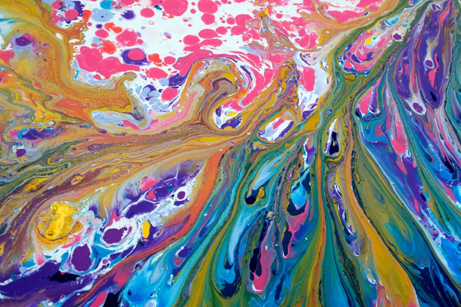

---

### Some artworks generated by the model 🎉 

Content image:

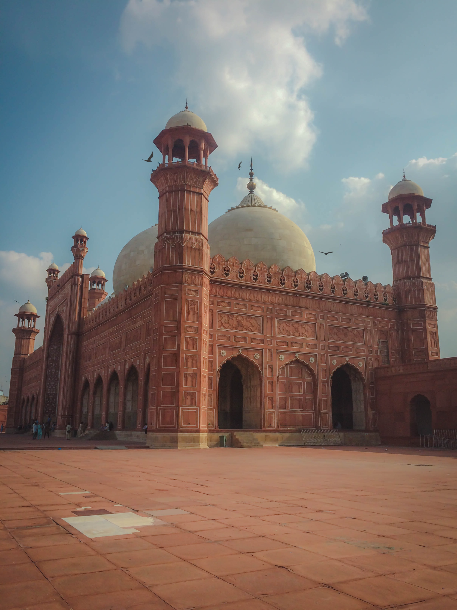

Generated images:  
    
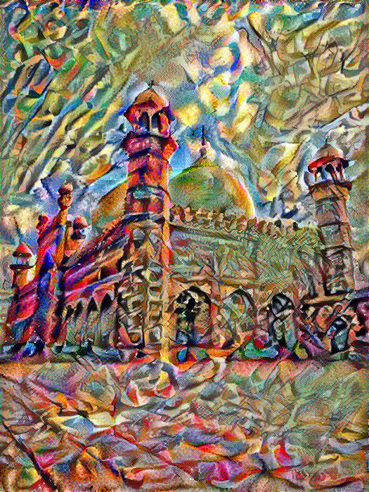 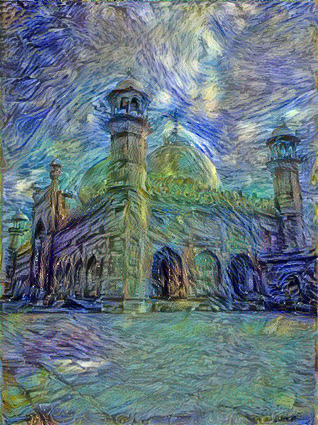 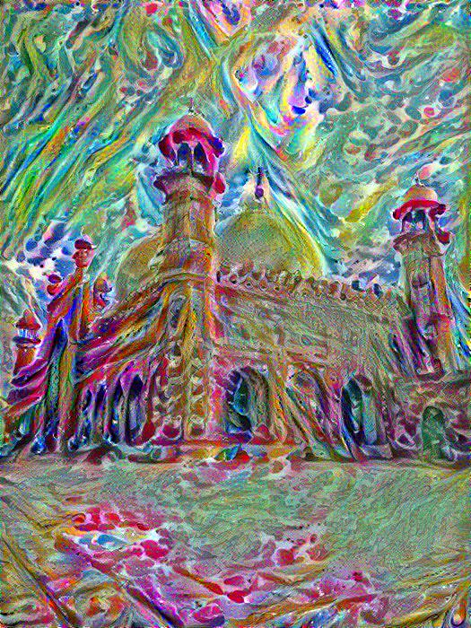

---

Content image:

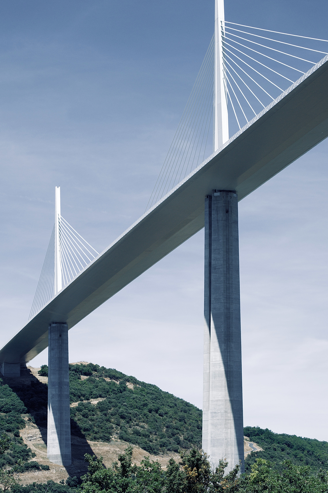

Generated images:  
    
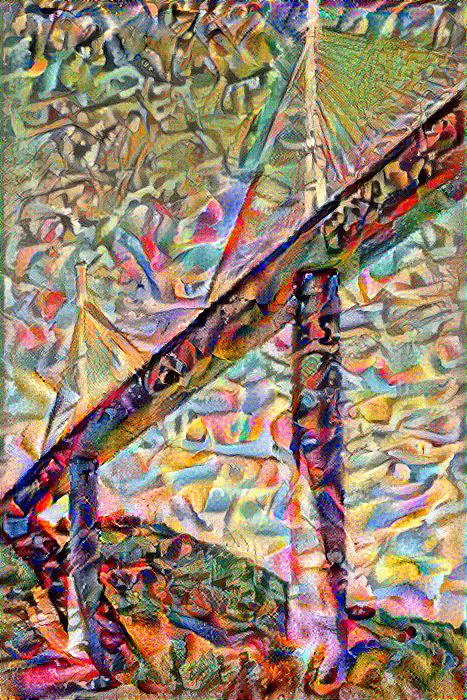 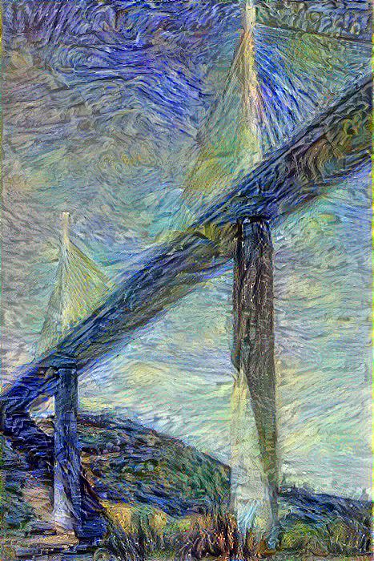 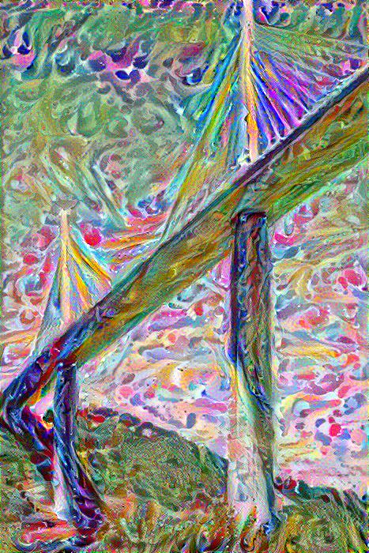

---

Content image:

Generated images:  
    
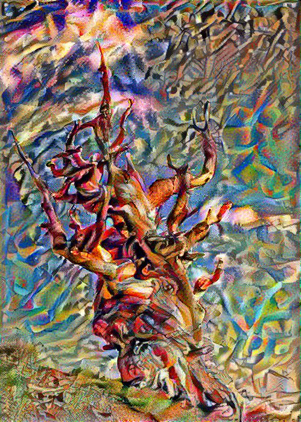 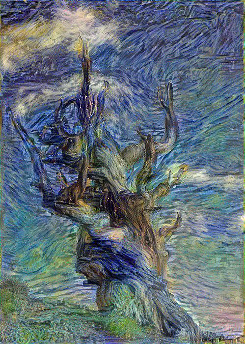 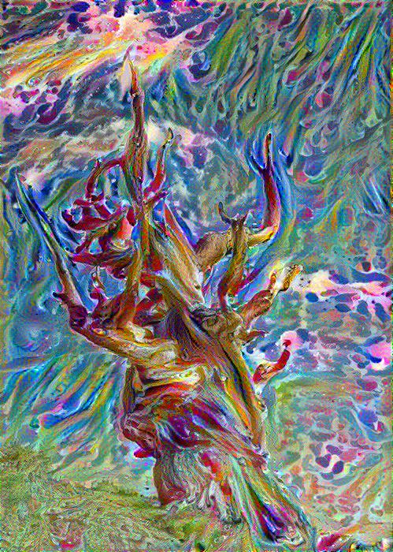

---

Content image:
 

Generated images:  
    
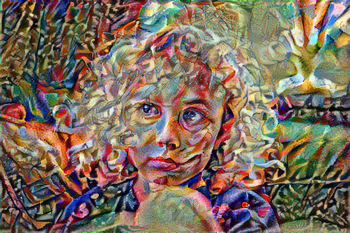 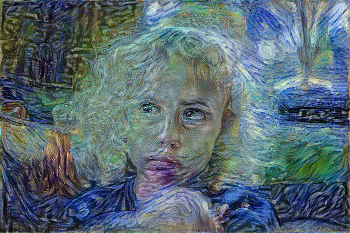 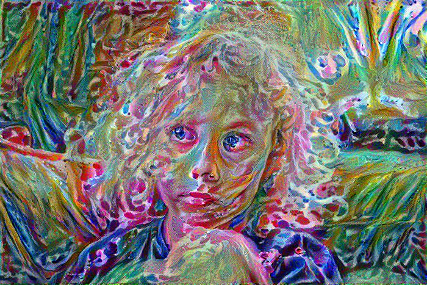

---

##### References 🙌
- [Neural Style Transfer: Creating Art with Deep Learning using tf.keras and eager execution](https://medium.com/tensorflow/neural-style-transfer-creating-art-with-deep-learning-using-tf-keras-and-eager-execution-7d541ac31398)
